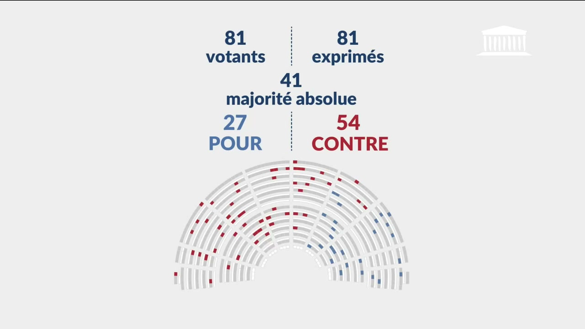

# spike 2026-07-03 — OCR de l'écran-résultat de scrutin public

Sur un **scrutin public**, la régie de l'Assemblée incruste dans la vidéo un
**écran-résultat** à template fixe : chiffres navy sur fond gris clair, positions
stables, fronton AN en haut-droite, hémicycle coloré en bas.



Il porte les compteurs **globaux** — `votants` / `exprimés` / `majorité absolue` /
`POUR` / `CONTRE` — mais **aucun numéro de scrutin ni nom de député**. C'est la **seule
source live du chiffré global** : le dérouleur ne donne que l'annonce, Eliasse le sort
qualitatif (adopté/rejeté).

Ce spike détecte l'écran dans une vidéo et en extrait **chiffres + timecode**, pour
émettre un signal `scrutin_result` réutilisable par B1. On **ne fait pas** le nominatif :
le « qui a voté quoi » vient de l'open-data (résolu plus tard, cf. *prochaine étape*).

Le spike est **isolé** : tout vit dans `spikes/2026-07-03-scrutin-ocr/`, rien n'est
touché dans b1/b2/b3/b4.

## Install

```bash
pip install pillow pytesseract
```

Plus deux binaires système, **déjà présents** sur la machine de dev :

- **tesseract** (moteur OCR). Windows : `C:\Program Files\Tesseract-OCR\tesseract.exe`.
  Auto-détecté (PATH, puis ce chemin par défaut) ; sinon passer `--tesseract PATH`.
  Le pack de langue `fra` est utilisé s'il est là ; à défaut l'OCR marche quand même
  (détection accent-insensible, et ce sont surtout des chiffres).
- **ffmpeg** / **ffprobe** (extraction de frames). Auto-détecté dans le PATH ; sinon
  `--ffmpeg PATH`.

> Note : `numpy` n'est **pas** requis. L'association chiffre↔label travaille directement
> sur les *bounding boxes* rendues par tesseract (géométrie), pas sur les pixels — donc
> ni numpy ni OpenCV.

## Comment ça marche

`read_result_screen(pil_image)` est le **cœur pur** (aucun accès disque) :

1. `tesseract` en mode `image_to_data` → chaque mot avec sa boîte.
2. **Détection** : c'est un écran-résultat seulement si on retrouve tout le jeu de
   mots-clés `votant / exprim / majorit / pour / contre`, en comparaison
   **accent-insensible** et **sous-chaîne** (robuste aux ratés d'accent de l'OCR, ex.
   `exprim�s`, `majorit�`). Sinon → `None`.
3. **Extraction sans ROI hardcodée** (robuste à la résolution) : chaque chiffre est le
   token numérique **juste au-dessus** de son label et centré dessus. Règle : parmi les
   nombres alignés en x (tolérance = 5× la hauteur du texte) et au-dessus (gap ≤ 2×
   hauteur), on prend le **gap vertical minimal**. Le tri sur le vertical — et non sur x —
   est essentiel : `81 exprimés` est presque à la même verticale que `CONTRE`. On ne
   filtre jamais sur la confiance OCR (le `27` réel sort à conf=0).
4. **Glass-box** : trois contrôles d'intégrité — `pour+contre==exprimes`,
   `exprimes<=votants`, `majorite==exprimes//2+1`. `ok` = tous vrais et aucun chiffre
   manquant ; `confidence` = fraction de checks passés, pénalisée si un chiffre manque.

`scan_video(...)` balaye la vidéo à `step_s` (frames extraites par input-seek ffmpeg,
qui saute au keyframe voisin — rapide, et l'écran reste affiché plusieurs secondes),
**déduplique** les détections consécutives du même écran en **un seul** event (lecture
stable = valeur modale sur la fenêtre, `t_ms` = milieu de fenêtre = proclamation).

## Usage CLI

```bash
# Debug : lire un seul écran → dict JSON sur STDOUT
python scrutin_ocr.py --frame fixtures/scrutin_20260626_2529.jpg
# → {"votants":81,"exprimes":81,"majorite":41,"pour":27,"contre":54,
#    "abstentions":0,"confidence":1.0,"ok":true}

# Vidéo : events scrutin_result en NDJSON sur STDOUT (pipe vers B1),
#         résumé lisible sur STDERR
python scrutin_ocr.py --video V.mp4 [--step 3] [--start S] [--end S]
```

Exemple réel (séance du 2026-06-26 au soir) :

```
$ python scrutin_ocr.py --video hemi_20260626213109_1.mp4 --start 1500 --end 1560
```

STDOUT (une ligne NDJSON par scrutin) :

```json
{"type":"scrutin_result","t_ms":1530000,"votants":81,"exprimes":81,"majorite":41,"pour":27,"contre":54,"abstentions":0,"confidence":1.0,"ok":true}
```

STDERR (résumé) :

```
[scrutin_ocr] 1 scrutin(s) détecté(s) dans hemi_20260626213109_1.mp4
  00:25:30  votants=81 exprimés=81 maj=41 POUR=27 CONTRE=54 abst=0  ok=True conf=1.0
```

## Test d'acceptation

```bash
pytest spikes/2026-07-03-scrutin-ocr/
```

Régénérer les fixtures (si besoin) depuis la vidéo source :

```bash
# écran-résultat (cas positif)
ffmpeg -nostdin -ss 1529 -i data/2026-06-26-evening/video/hemi_20260626213109_1.mp4 \
   -frames:v 1 -q:v 2 -y spikes/2026-07-03-scrutin-ocr/fixtures/scrutin_20260626_2529.jpg
# perchoir ~9 s plus tôt (cas négatif → None)
ffmpeg -nostdin -ss 1520 -i data/2026-06-26-evening/video/hemi_20260626213109_1.mp4 \
   -frames:v 1 -q:v 2 -y spikes/2026-07-03-scrutin-ocr/fixtures/plateau_20260626_2520.jpg
```

## Intégration B1 (faite)

Le spike est branché dans B1. Le chemin complet, du direct à l'open-data :

**1. En direct — le chiffré global tissé dans le thread.** Un worker OCR (façon
`DiarWorker`) tourne à côté du STT sur la même `--source` et tisse un nœud `kind:ballot`
*chiffré* (`source:"ocr"`) à chaque proclamation, attaché à l'amendement courant déduit
de la parole :

```bash
python b1-weaver/weaver_live.py --source V.mp4 --agenda derouleur.json --ocr
# → nœud ballot: {"kind":"ballot","source":"ocr","text":"Rejeté",
#    "result":{"votants":81,"exprimes":81,"majorite":41,"pour":27,"contre":54,
#    "abstentions":0},"confidence":1.0,"canonical":{...,"scrutin":null}}
```

- `b1-weaver/deduce.py` : `Deducer.feed_scrutin_result(event)` — transforme l'event OCR
  en nœud ballot chiffré, sort déduit du seuil de majorité absolue affiché. C'est du cœur
  PUR (testé, `test_deduce.py`). `canonical.scrutin` reste `null` : l'écran ne porte ni
  numéro ni nominatif.
- `b1-weaver/weaver_live.py` : `OcrWorker` — pipe les frames (`ffmpeg -f image2pipe`),
  OCR, déduplique (réutilise le folding du spike), appelle `feed_scrutin_result`.
  **`--ocr-step 2`** par défaut : l'écran ne reste que ~3-4 s, un pas plus grand le rate.

**2. Après séance — la résolution du numéro de scrutin.** L'analyse consolidée
(`assemblee.scrutins`, avec le nominatif) est publiée *après* la séance. On la matche
contre les ballots OCR du thread pour remplir `canonical.scrutin` :

```bash
python b1-weaver/resolve_scrutin.py --thread thread.ndjson --seance RUANR5L17S2026IDS30769
# → {"type":"scrutin_resolved","scrutin":"VTANR5L17V7706","numero":"7706",
#    "code":"rejeté","method":"chiffres"}
```

- `b1-weaver/resolve_scrutin.py` : `match_scrutin(reading, scrutins, amendement_uid)` —
  cœur PUR (testé, `test_resolve_scrutin.py`). Signature de match = les compteurs, très
  discriminants ; en cas d'ex æquo réel (vu le 26/06 : 91/33/58 sur les amdt 453 **et**
  456) on départage par l'amendement (`canonical.amendement_uid` de B1 **est** le
  `amendementRefUid` du scrutin). Sans départage → `None` (honnêteté). `fetch_scrutins`
  fait l'I/O (API `parlement.tricoteuses.fr/scrutins`, sans auth) ; le `seanceRefUid` se
  lit dans le dérouleur de la séance.

**Validé sur du réel** : le scrutin du 26/06 à 00:25:30 (81/81/41/27/54) se résout, par
les seuls chiffres, en scrutin **n° 7706** (amendement 1136 de Mme Pollet, rejeté),
unique parmi les 29 scrutins de la séance. D'où découle le nominatif (open-data).

Fixture open-data de la séance : `fixtures/scrutins_seance_20260626.json` (29 scrutins,
régénérable via `resolve_scrutin.fetch_scrutins("RUANR5L17S2026IDS30769")`).
